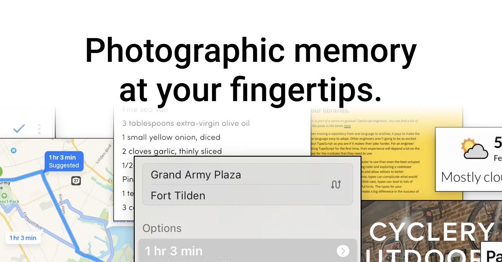

# [screenhint.com](https://www.screenhint.com)



A homepage for Screenhint, forked from [11ty-landing-page](https://github.com/ttntm/11ty-landing-page).

## Running locally

Start up a development server at `http://localhost:8080`:
```sh
git clone git@github.com:salemhilal/screenhint-site.git
cd screenhint-site
npm install
npm run serve
```

Build the site for production:
```
npm run deploy
```

## Basic configuration

1. Eleventy -> `./.eleventy.js`
2. Tailwind -> `./tailwind.config.js`
3. Netlify -> `./netlify.toml`

CSS is built via PostCSS and based on `./src/_includes/css/_page.css`. Building CSS gets triggered by `./src/css/page.11ty.js`.

Please note that this CSS build _does not_ include the `normalize.css` file used for the 2 regular pages (imprint, privacy) - a minified production version is stored in `./src/static/css` and gets included in the build by default.

## Changing content

Page content is stored in

- `./src/`
  - `imprint.md`
  - `privacy.md`
- `./src/sections/`
- `./src/_data/features.json`

## Changing templates / layouts

Page structure and templates are stored in `./src/_layouts/` and can be edited there.

Best have a look at `./layouts/base.njk` first to understand how it all comes together - the page itself is constructed from partial templates stored in `./src/includes/` and each section has a corresponding template file (`section.**.njk`) stored there.

`index.njk` in `./src/` arranges everything, meaning that sections can be added/re-ordered/removed/... there.